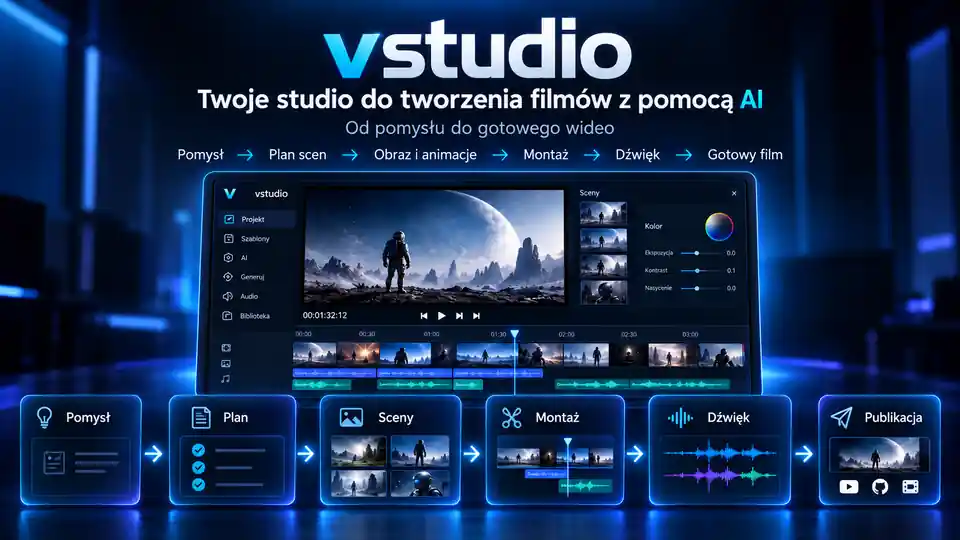
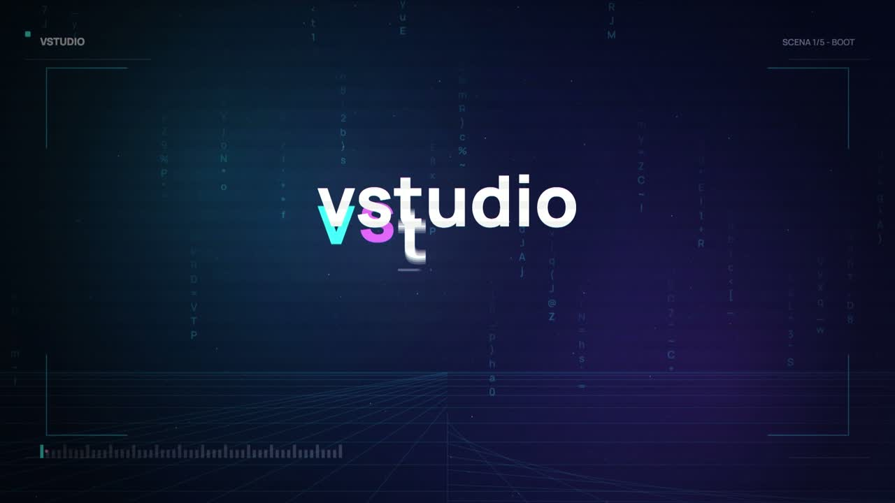
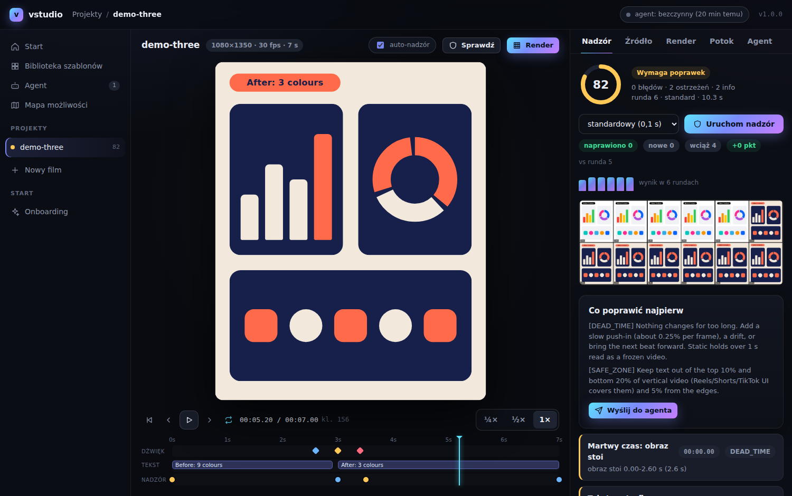

<div align="center">

# vstudio



**Twoje studio do tworzenia filmów z pomocą AI.**

Od pomysłu do gotowego wideo.

[Szybki start](#szybki-start) · [Przykłady](#przykłady) · [Praca z AI](#praca-z-agentem-ai) · [Dokumentacja techniczna](REFERENCE.md)

Python 3.11+ · Lokalny render · CLI, dashboard i integracja z agentem · [MIT](LICENSE)

</div>

> Baner jest wizualizacją koncepcji pracy, nie zrzutem aktualnego interfejsu. Podgląd dashboardu znajdziesz niżej.

## Co to jest

**vstudio to lokalny zestaw narzędzi do tworzenia filmów, animacji i rolek.** Łączy planowanie scen, przygotowanie grafik i animacji, montaż, dźwięk oraz kontrolę jakości w jeden proces.

Możesz obsługiwać go poleceniami w terminalu, korzystać z dashboardu w przeglądarce lub udostępnić narzędzia agentowi AI. Agent pomaga przygotować kod scen i wykonać kolejne etapy pracy. Model i agenta podłączasz osobno.

To warsztat do budowania wideo krok po kroku, **nie generator, który sam tworzy dowolny film z jednego zdania**. W podstawowym trybie sceny są zapisane jako HTML, CSS i JavaScript, a vstudio zamienia je w klatki i plik wideo.

### Jak to działa

**Pomysł → Plan scen → Obraz i animacje → Montaż → Dźwięk → Gotowy film**

| Etap | Co robisz |
| --- | --- |
| **Pomysł** | Określasz odbiorcę, cel, główny przekaz i długość filmu. |
| **Plan scen** | Rozpisujesz kolejność ujęć, teksty i momenty zmian. |
| **Obraz i animacje** | Tworzysz sceny z grafik, napisów i własnych materiałów. |
| **Montaż** | Układasz materiał w czasie, dobierasz przejścia i sprawdzasz tempo. |
| **Dźwięk** | Dodajesz efekty i przygotowujesz miks zsynchronizowany z obrazem. |
| **Gotowy film** | Sprawdzasz wynik i przygotowujesz plik oraz paczkę materiałów do publikacji. |

Eksport to przygotowanie plików. Nie oznacza automatycznego opublikowania filmu w social mediach.

## Możliwości

| Zastosowanie | Narzędzia w projekcie |
| --- | --- |
| **Animacje i krótkie materiały promocyjne** | Sceny HTML, szablon startowy i przykłady animacji. |
| **Rolki z napisami** | Formaty rolek, napisy słowo po słowie i przezroczyste nakładki na własne nagrania. |
| **Grafiki do scen** | Biblioteka ikon, generowanie grafik i rejestr źródeł materiałów. |
| **Planowanie i kontrola jakości** | Plan scen, klatki kontrolne, sprawdzanie tekstów i przegląd przed finalnym eksportem. |
| **Dźwięk** | Generowane efekty, synchronizacja zdarzeń i miks audio. |
| **Automatyzacja pracy** | Polecenia CLI oraz serwer MCP, przez który agent może korzystać z narzędzi studia. |

Kontrole techniczne pomagają wykrywać błędy, ale nie zastępują obejrzenia filmu. Przed eksportem sprawdź klatki, napisy i dźwięk.

## Showreel

Przykładowy materiał trwa **25 sekund** i pokazuje pięć scen: typografię, analizę obrazu, montaż, dźwięk i wydanie filmu.

[](assets/showreel.mp4)

[Obejrzyj wideo](assets/showreel.mp4) · [Zobacz kod sceny](examples/showreel/index.html) · [Zobacz zestaw klatek](assets/contact_sheet.png)

## Szybki start

Potrzebujesz **Pythona 3.11 lub nowszego**, Gita oraz **FFmpeg i FFprobe dostępnych w PATH**. Podstawowy silnik HTML nie wymaga Node.js. Opcjonalne silniki mają dodatkowe wymagania opisane w [dokumentacji technicznej](REFERENCE.md#wymagania).

### 1. Pobierz projekt

```bash
git clone https://github.com/aievolutionpl/vstudio.git
cd vstudio
```

### 2. Przygotuj osobne środowisko Pythona

**Windows, PowerShell:**

```powershell
py -3 -m venv .venv
.\.venv\Scripts\Activate.ps1
```

**macOS lub Linux:**

```bash
python3 -m venv .venv
source .venv/bin/activate
```

### 3. Zainstaluj zależności i sprawdź konfigurację

W aktywnym środowisku wykonaj:

```bash
python -m pip install -r requirements.txt
python -m playwright install chromium
python vstudio.py doctor
```

`doctor` sprawdza wymagane narzędzia. Uzupełnij brakujące elementy przed renderowaniem. Instalacja pakietów Pythona nie instaluje FFmpeg.

### 4. Otwórz studio

```bash
python vstudio.py dashboard
```

Otwórz lokalny adres pokazany w terminalu. Dashboard służy do pracy z projektami, podglądu scen, kontroli jakości i śledzenia zadań.



<details>
<summary>Problemy z pierwszym uruchomieniem</summary>

- **Brak FFmpeg lub FFprobe:** zainstaluj oba narzędzia, dodaj je do PATH i ponownie uruchom terminal.
- **Brak Chromium:** wykonaj `python -m playwright install chromium` w tym samym środowisku Pythona.
- **PowerShell blokuje aktywację środowiska:** używaj `.\.venv\Scripts\python.exe` zamiast `python` w kolejnych poleceniach. Nie musisz zmieniać zasad wykonywania skryptów.
- **Nie wiesz, co dalej:** uruchom `python vstudio.py --help` albo `python vstudio.py status -p nazwa-projektu`.

</details>

## Przykładowa scena

Zacznij od istniejącego showreela, zamiast budować wszystko od zera. Poniższy przykład tworzy nowy projekt i przygotowuje **robocze wideo bez dźwięku**.

Uruchom polecenia w katalogu repozytorium, po konfiguracji środowiska:

```bash
python vstudio.py new moje-demo --brand demo --engine html --size 1920x1080 --fps 30 --duration 25
python -c "from shutil import copyfile; copyfile('examples/showreel/index.html', 'output/demo/moje-demo/src/index.html')"
python vstudio.py readcheck -p moje-demo
python vstudio.py still -p moje-demo --times 1,6,11,16,21
python vstudio.py render -p moje-demo
python vstudio.py status -p moje-demo
```

Obejrzyj klatki w `output/demo/moje-demo/stills/` i roboczy render w `output/demo/moje-demo/renders/`. Polecenie kopiowania zastępuje scenę startową tylko w nowo utworzonym projekcie `moje-demo`.

Finalny eksport to osobny etap: przygotuj dźwięk, przejrzyj materiał i zatwierdź go zgodnie z [procedurą przeglądu](REFERENCE.md#reżyser-plan-przegląd-i-zatwierdzenie-przed-wysyłką). Nie traktuj udanego renderu roboczego jako potwierdzenia jakości gotowego filmu.

## Przykłady

W repozytorium znajdziesz kod, który możesz przeglądać, zmieniać i wykorzystać jako punkt wyjścia:

| Materiał | Czego możesz się nauczyć |
| --- | --- |
| [Showreel: pięć scen w 25 sekund](examples/showreel/index.html) | Łączenie typografii, przejść, osi czasu i wizualizacji dźwięku. |
| [Sześć krótkich animacji](examples/motion-graphics/README.md) | Budowanie ruchu, ukrywanie cięć, praca z ograniczoną paletą i jednym głównym obiektem. |
| [Napisy słowo po słowie](examples/reel-formats/word-captions.html) | Animowane napisy do krótkich materiałów. |
| [Rolka prezentująca zasób](examples/reel-formats/resource-drop.html) | Przykładowa struktura krótkiej prezentacji materiału. |
| [Scena startowa HTML](templates/html-video-starter.html) | Przygotowanie własnej sceny zgodnej z wymaganiami vstudio. |

Przykłady w `motion-graphics` pobierają GSAP z CDN. Do pracy offline potrzebna jest lokalna kopia biblioteki.

### Pomysły na własne materiały

Poniższe briefy to propozycje do wykonania z agentem, nie dodatkowe gotowe filmy w repozytorium.

**Prezentacja narzędzia AI**

> Przygotuj 15-sekundową rolkę 9:16. Pokaż jeden problem, trzy kroki rozwiązania i prostą planszę końcową. Użyj dużych napisów i moich zrzutów ekranu. Najpierw przedstaw plan scen i klatki do oceny.

**Animowana reklama usługi**

> Przygotuj 20-sekundowe wideo 4:5 na podstawie mojego briefu i materiałów marki. Jeden główny komunikat, czytelna oferta i jedno wezwanie do działania. Bez drobnego tekstu i wymyślonych wyników. Zacznij od planu, nie od finalnego renderu.

**Nakładka na własne nagranie**

> Zaprojektuj animowane napisy i proste wyróżnienia do mojego nagrania. Dopasuj czas do dostarczonej transkrypcji. Przygotuj przezroczystą nakładkę, sprawdź marginesy i pokaż klatki kontrolne przed eksportem.

## Praca z agentem AI

Agent musi mieć dostęp do repozytorium i skonfigurowanego środowiska. vstudio udostępnia **MCP**, czyli sposób przekazania agentowi narzędzi do obsługi studia, oraz [instrukcję pracy](skills/vstudio/SKILL.md).

```bash
python vstudio.py mcp
```

To polecenie uruchamia serwer MCP. Połączenie skonfiguruj w swoim kliencie agenta zgodnie z jego ustawieniami. Szczegóły instalacji skilla, nadzoru i pracy przez dashboard są w [instrukcji technicznej](REFERENCE.md#studio-agent-nadzór-jakości-i-dashboard).

Przykładowe polecenie na początek:

```text
Pracuj w repozytorium vstudio. Przeczytaj skills/vstudio/SKILL.md
oraz mój brief. Sprawdź środowisko poleceniem doctor.
Najpierw przygotuj plan scen, a potem roboczą wersję filmu.
Pokaż klatki kontrolne i wyniki sprawdzeń. Popraw wykryte błędy.
Przed finalnym eksportem poproś mnie o ocenę materiału.
Nie pomijaj kontroli jakości i nie wymyślaj brakujących materiałów marki.
```

## Dokumentacja

| Potrzebujesz | Otwórz |
| --- | --- |
| Pełnych komend, parametrów i kolejności pracy | [REFERENCE.md](REFERENCE.md) |
| Szczegółowej listy dostępnych operacji | [Mapa możliwości](docs/CAPABILITIES.md) |
| Instrukcji dla agenta | [Skill vstudio](skills/vstudio/SKILL.md) |
| Wzoru opisu filmu | [Szablon briefu](templates/BRIEF.md) |
| Planów rozwoju projektu | [Roadmap](docs/ROADMAP.md) |

Dotychczasowa rozbudowana instrukcja została zachowana w `REFERENCE.md`. README jest teraz krótszym wejściem do projektu.

### Co oznacza „powtarzalny render”?

Animacja jest opisana kodem i czasem. Przy tych samych plikach i zgodnym środowisku klatka z danego momentu powinna wyglądać tak samo, niezależnie od kolejności jej odtwarzania. Dzięki temu łatwiej poprawiać sceny i sprawdzać, czy zmiana kodu nie zepsuła obrazu. W dokumentacji technicznej ta cecha jest nazywana determinizmem. Nie jest to obietnica identycznych plików na każdym komputerze.

## Prywatność

Podstawowy proces renderowania działa lokalnie. Pobieranie bibliotek i zewnętrznych materiałów wymaga połączenia z siecią. Osobno podłączony agent lub model może korzystać z usług chmurowych zgodnie ze swoją konfiguracją. Nie zakładaj, że cały proces jest offline tylko dlatego, że render wykonuje się na twoim komputerze.

## Licencja

Kod vstudio jest dostępny na licencji [MIT](LICENSE). Własne zdjęcia, nagrania, fonty, pobrane materiały i opcjonalne silniki mają odrębne zasady licencyjne. Sprawdzaj prawa do materiałów używanych w filmie.

---

**AI Evolution Polska** · Narzędzia do tworzenia wideo i automatyzacji pracy z AI.
