<div align="center">

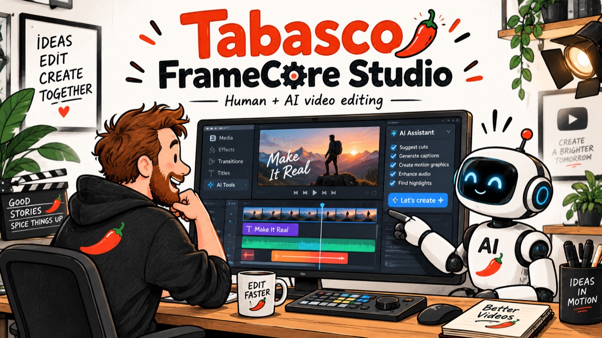

# TABASCO CREATIVES + FRAMECORE — STUDIO

<picture>
  <source media="(prefers-color-scheme: dark)" srcset="assets/framecore-logo-reversed.svg">
  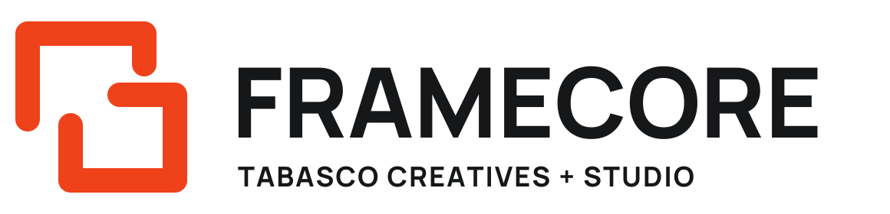
</picture>

**Projekt współpracy: człowiek, agent AI i jeden wspólny montaż.**

Lokalne studio do tworzenia filmów, animacji i rolek. Ty układasz historię i poprawiasz sceny; agent korzysta z tych samych materiałów, zaznaczenia, osi czasu i historii cofania.

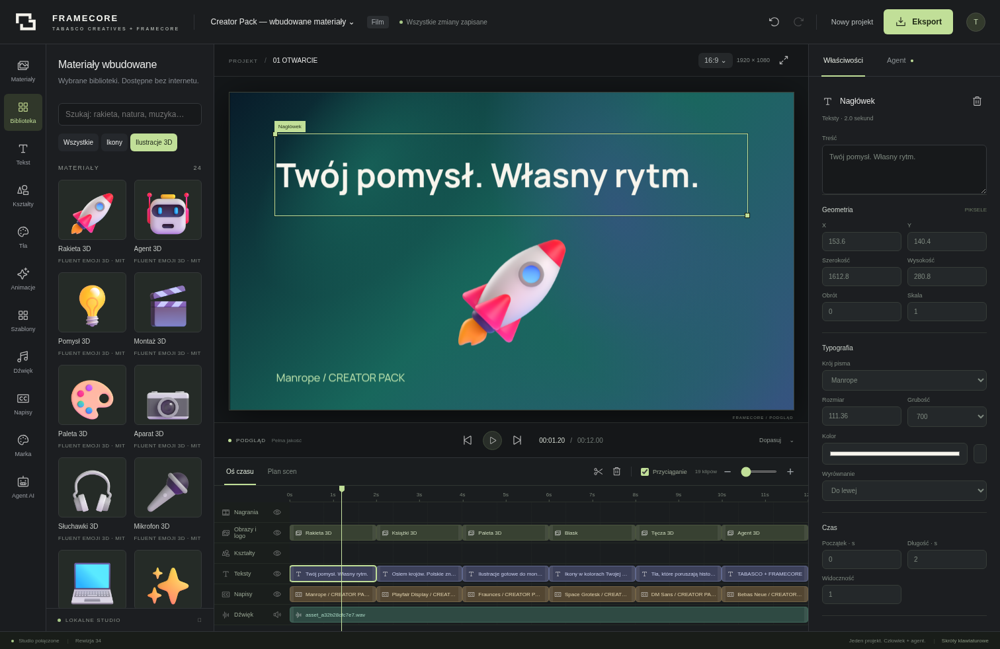

Python 3.11+ · FFmpeg · Chromium · [Kod MIT](LICENSE) · [Licencje bibliotek](THIRD_PARTY_NOTICES.md)

**[▶ Zobacz filmy demo](#filmy-demo)** · [Ruch 2.0](docs/MOTION_2.md)

</div>

## Nowość: Ruch 2.0

Silnik animacji dostał **tekst kinetyczny** (litery i słowa animowane osobno: maszyna do pisania, kaskada, dekodowanie, karaoke), **wyjścia** łączące się z każdym wejściem, nowe kinowe wejścia (Ken Burns, przesłona, glitch, wahadło 3D) i krzywe z odbiciem oraz elastyczne. Elementom nadasz **cień, neon, gradient, obrys i tryb mieszania**, a całemu filmowi **look**: korekcję koloru, winietę, ziarno, kaszetę i **rozmycie ruchu** w eksporcie. Każde cięcie może mieć własne przejście — od light leaka i błysku po **8 przejść ✦ wzorowanych na shaderach [HyperFrames](https://github.com/heygen-com/hyperframes)**: rozpływ z żarzącą się krawędzią, wypalenie, szybką panoramę, przesłonę z obręczą, kinowy zoom, glitch, rozszczepienie RGB i płynne przenikanie. Sceny nakładają się jak w profesjonalnym montażu, a `inspect_project` dostał nowe reguły kontroli wzorowane na lincie HyperFrames. Pięć looków — *Czysty, Kino, Rolka, Retro, Noir* — ustawisz jednym kliknięciem; każdy z 12 szablonów ma własny kierunek ruchu.

Panel **Animacje** ma filtry i podgląd na żywo, a **Właściwości** — osobne sekcje *Ruch* (wejście, wyjście, czas, krzywa, podgląd) i *Wygląd i efekty*. Wszystko działa też przez MCP: `apply_exit`, `set_canvas_fx`, `set_scene_transition` i nowe pola `style`. Podgląd i eksport pozostają identyczne klatka w klatkę. [Opis i przykłady wywołań](docs/MOTION_2.md).

## Agent w studiu i nowa kampania

**Rozmawiaj z własnym modelem bez wychodzenia z edytora.** W **Integracjach** wybierz OpenRouter lub OpenAI, zapisz klucz lokalnie, pobierz modele i sprawdź obsługę narzędzi. Panel **Twój agent** czyta projekt, wykonuje polecenia montażowe i pokazuje każdą operację. Zmiany trafiają do wspólnej historii cofania. Istniejący panel zadań Codex/Claude, Company brain oraz narzędzia produkcyjne pozostają dostępne.

Samouczek **Jak zacząć** prowadzi przez projekt, materiały, montaż, agenta i eksport. Integracje pokazują także gotowość FFmpeg/Chromium i konfigurację MCP dopasowaną do tego komputera. [Instrukcja użytkownika i agenta](docs/AGENT_QUICKSTART.md).

[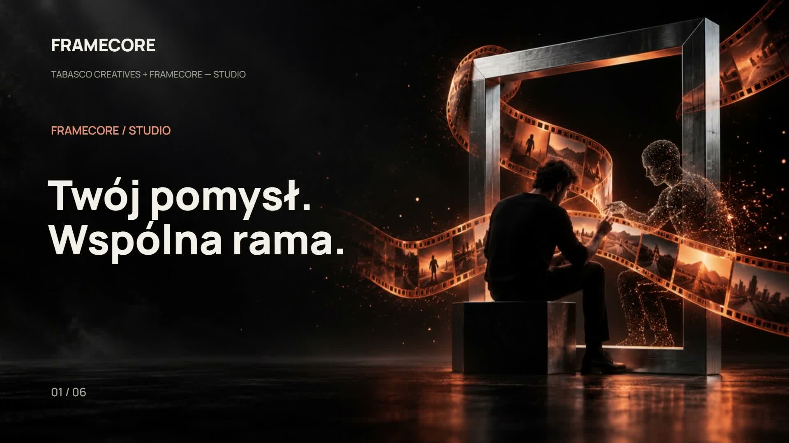](assets/framecore-agent-campaign.mp4)

**[Obejrzyj reklamę 30 s](assets/framecore-agent-campaign.mp4)** · [Sześć scen](assets/framecore-agent-campaign-frames.jpg) · [Pochodzenie materiałów i prompty](docs/CAMPAIGN_ASSETS.md)

Film ma sześć scen po **5 sekund**, sześć różnych animacji nagłówków, trzy nowe tła generowane AI i lokalnie przygotowany podkład. Eksport: 1920 × 1080, 30 fps, H.264 + AAC. Tła **FrameCore Cinema** są dostępne w bibliotece studia z odrębną informacją o pochodzeniu. Utwórz własną, edytowalną kopię:

```bash
python framecore.py sample --campaign
```

`python scripts/render-campaign.py` tworzy projekt i eksportuje tę reklamę do `assets/framecore-agent-campaign.mp4`. Na Windows możesz uruchamiać studio przez `START-STUDIO.cmd`. Materiały AI dołączone do repozytorium nie oznaczają, że aplikacja ma skonfigurowany generator obrazów lub wideo.

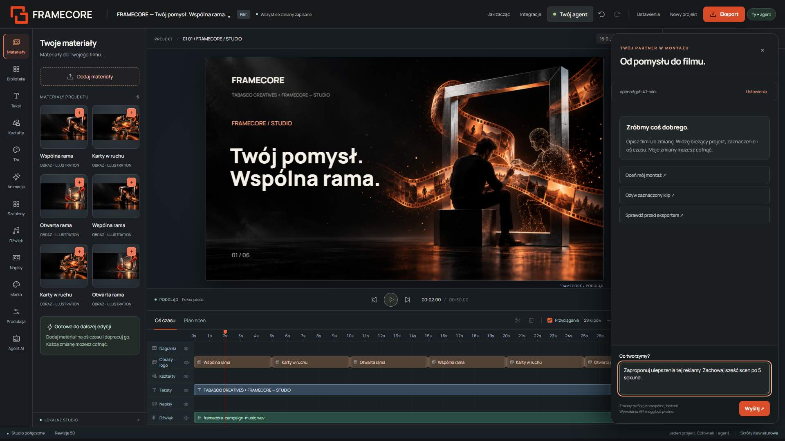

Testy obejmują onboarding i rozmowę w Chromium, rzeczywistą edycję przez narzędzia, konflikty rewizji, zatrzymanie, ochronę konfiguracji i eksport. Szczegóły oraz granice walidacji: [wydanie agenta](docs/AGENT_RELEASE_VALIDATION.md).

## Dopracowany edytor

Grafitowy interfejs, większe opisy i ciepłe akcenty Tabasco pomagają skupić się na filmie. Biblioteka ma **ulubione materiały i filtrowanie kolekcji**; panel tekstu pokazuje typografię przed geometrią. Sześć przycisków wyrównuje element w kadrze, a wybór animacji uruchamia krótki podgląd na zaznaczonym klipie.

Na telefonie biblioteka i właściwości otwierają się jako panele. Obsługują klawiaturę, Escape i powrót do przycisku, który je otworzył. Tworzenie projektu, wybór istniejącego projektu i eksport są dostępne również w małym widoku. [Biblioteka na telefonie](assets/framecore-editor-mobile.png) · [Właściwości](assets/framecore-editor-mobile-properties.png).

W panelu **Marka → Dodaj logo FrameCore** umieścisz nowy znak w filmie. To zwykły edytowalny klip: możesz zmieniać jego pozycję, rozmiar i ruch albo cofnąć dodanie.

## Montaż ręczny i praca z agentem

Przeciągaj media z biblioteki lub komputera na timeline. Upuść nowe zdjęcie albo nagranie na klip, aby podmienić źródło **bez utraty pozycji, czasu i animacji**. Miniatury, dodatkowe ścieżki, blokady, przyciąganie do krawędzi i duplikowanie pomagają dopracować film po pracy agenta. Te same operacje są dostępne przez MCP i w dashboardzie AI.

W **Produkcja → Lekcja przez historię** przygotujesz siedem edytowalnych scen, osobny tekst lektora i opis przejść. Opcjonalny papierowy kierunek korzysta z kremu, koralu i Manrope; profile klientów domyślnie zachowują swój wygląd. Plan wymaga uzupełnienia przykładów, obrazu i audio oraz przeglądu przed finalnym eksportem. [Instrukcja montażu i nowych narzędzi](docs/COLLABORATIVE_EDITING.md).

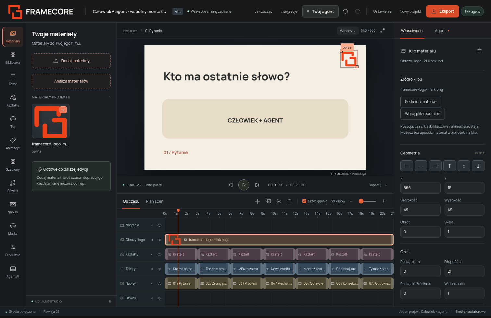

[Przykład 21 sekund](assets/framecore-visual-lesson-demo.mp4) · [Edytowalny projekt i uruchomienie](examples/visual-lesson/README.md) · [Plan scen i tekst lektora](assets/framecore-lesson-inspector.png). To roboczy pokaz typograficzny bez nagranego lektora.

## Profile marek · Company brain

W **Ustawieniach** zapiszesz profile firm: opis, produkty i usługi, odbiorców, ton komunikacji, design guidelines, kolory, font, logo oraz zdjęcia referencyjne. Wybierz profil przy pracy nad filmem — projekt otrzyma własną kopię informacji i materiałów, a agent wykorzysta ten kontekst do montażu. Zmiana biblioteki nie zmieni wcześniejszych projektów.

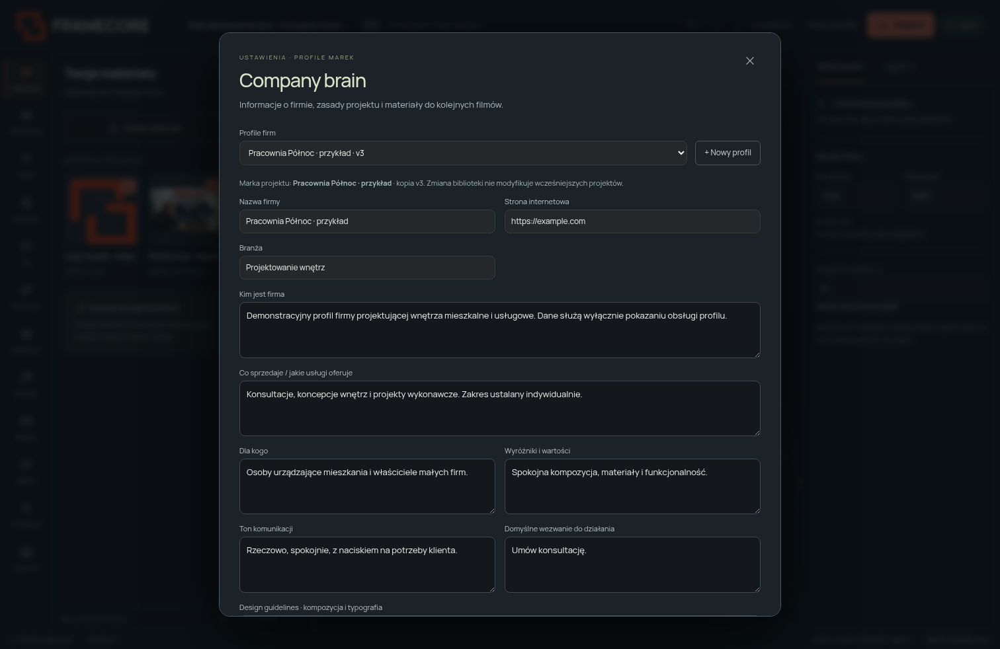

Agent może przygotować szkic na podstawie dostarczonych treści i źródeł; przeglądasz go w formularzu przed zapisem. Agent zewnętrzny z narzędziami researchu zapisuje profile przez MCP. [Instrukcja profili marek i API](docs/COMPANY_BRAIN.md).

## Produkcja na podstawie dowodów

Nowy panel **Produkcja** prowadzi przez brief reżyserski, wymagane prawdziwe materiały i storyboard opisany jako stany oraz beaty. **Plansza rzeczywistych klatek** pokazuje momenty scen i przejścia; pomiar wykrywa tekst poza polem oraz elementy poza kadrem. Zatwierdzasz checklistę i zapisujesz uwagi do konkretnej rewizji. Opcjonalna bramka zatrzyma finalny eksport po zmianach aż do nowego przeglądu.

Reguły ruchu różnicują czas i krzywą dla napisów, tekstu i ilustracji. Warianty **16:9, 9:16, 4:5 i 1:1** powstają jako niezależne projekty z osobnym układem startowym oraz własną oceną. Po renderze pobierzesz **ZIP: film, projekt, materiały, brief, shot list, reguły ruchu, przegląd i informacje o licencjach**.

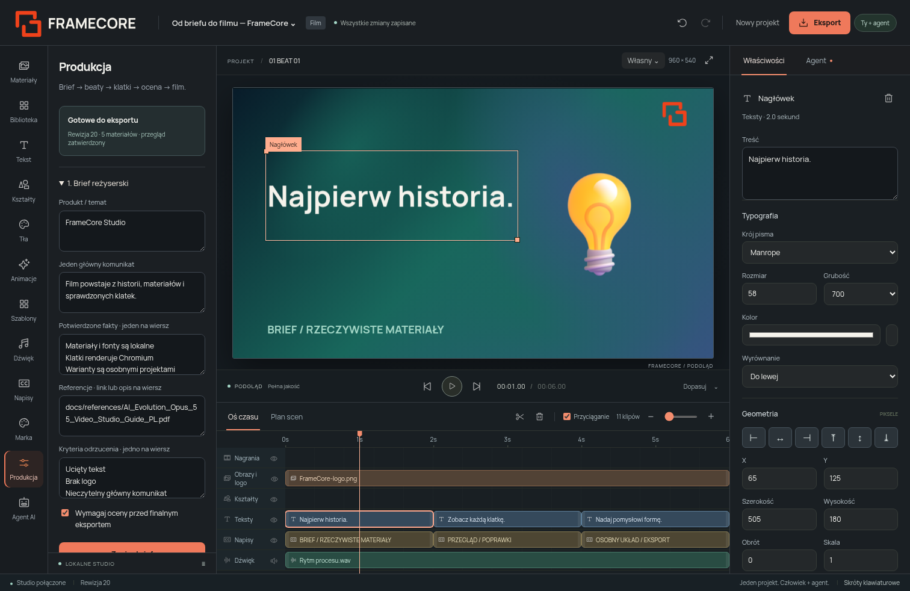

[Jak korzystać z pipeline’u](docs/PRODUCTION_PIPELINE.md) · [Film 6 sekund](assets/framecore-production-demo.mp4) · [Paczka przykładu](assets/framecore-production-delivery.zip) · [Edytowalny projekt](examples/production-pipeline/project.json) · [Dostarczony przewodnik PDF](docs/references/AI_Evolution_Opus_55_Video_Studio_Guide_PL.pdf).

## Jak działa projekt

**Pomysł → materiały → plan scen → wspólny montaż → podgląd → MP4.**

Projekt ma jeden zapis JSON. Interfejs, API i serwer MCP czytają ten sam stan. Zmiana agenta pojawia się w edytorze, a przycisk cofania działa również dla jego operacji. Numer rewizji chroni przed nadpisaniem nowszego montażu. Większe zmiany można przygotować jako propozycję, obejrzeć i zastosować jednym krokiem.

Podgląd korzysta z lokalnej biblioteki HyperFrames Player. Render zapisuje klatki przez Chromium i składa film oraz dźwięk za pomocą FFmpeg. Do uruchomienia podstawowego studia nie potrzebujesz serwera Node ani CDN.

## Uruchom na swoim komputerze

Zainstaluj Python 3.11 lub nowszy, Git oraz FFmpeg z FFprobe dostępnymi w PATH.

```bash
git clone https://github.com/aievolutionpl/TABASCO-FRAMECORE-STUDIO.git vstudio
cd vstudio
python3 -m venv .venv
source .venv/bin/activate
python -m pip install -r requirements.txt pytest
python -m playwright install chromium
python framecore.py editor
```

Na Windows aktywuj środowisko poleceniem `.venv\Scripts\Activate.ps1`. Instrukcja i skrypty instalacji: [Uruchomienie lokalne](docs/URUCHOMIENIE_LOKALNE.md).

`python framecore.py editor` uruchamia studio na porcie 8877. `python vstudio.py dashboard` otwiera tę samą aplikację na porcie 8765. Starszy dashboard jest dostępny przez `python vstudio.py dashboard --legacy`.

## Pierwszy film

1. Otwórz projekt przykładowy lub utwórz własny.
2. Dodaj zdjęcie produktu, logo, nagranie i dźwięk.
3. W panelu **Szablony** wybierz strukturę filmu i przejrzyj plan scen.
4. Zbuduj montaż, popraw teksty i dobierz animacje.
5. Przesuwaj, przycinaj i dziel klipy na osi czasu. Sprawdź podgląd i dźwięk.
6. Wyeksportuj film do MP4.

Przykład FORM zawiera własną ilustrację produktu i proceduralnie przygotowany podkład. Materiały przykładowe nie są przedstawiane jako wyniki generatora AI.

## Przykład współpracy

[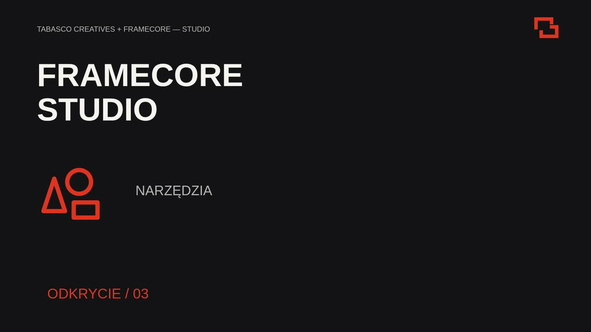](assets/framecore-collaboration.mp4)

[Obejrzyj film 15 sekund](assets/framecore-collaboration.mp4) · [Klatki kontrolne](assets/framecore-collaboration-frames.jpg) · [Edytowalny zapis projektu](examples/framecore-collaboration/project.json)

Film 1920 × 1080 pokazuje sześć scen z polskimi tekstami, ikonami MIT i własnym podkładem. Utwórz jego lokalną wersję poleceniem `python framecore.py sample`, następnie wybierz projekt w menu studia.

## Wbudowane materiały

**Biblioteka** pozwala wyszukiwać ikony Phosphor, Tabler i Lucide oraz ilustracje Microsoft Fluent Emoji. **Tekst** i **Marka** udostępniają lokalne fonty: Manrope, Space Grotesk, Playfair Display, Fraunces, Bebas Neue, DM Sans, DM Serif Display i JetBrains Mono. W panelu **Tła** wybierzesz gradienty, wzory i animowane kompozycje.

[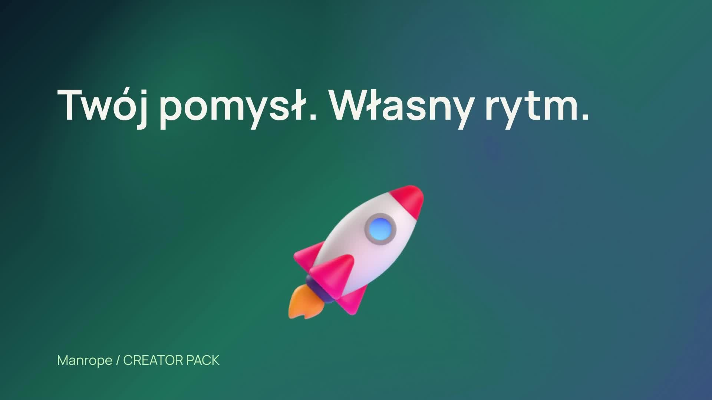](assets/framecore-creator-pack.mp4)

[Obejrzyj pokaz 12 sekund](assets/framecore-creator-pack.mp4) · [Przegląd 12 szablonów](assets/framecore-templates.jpg) · [Instrukcja Creator Pack](docs/CREATOR_PACK.md)

Utwórz edytowalną kopię pokazu: `python framecore.py sample --creator-pack`. Po instalacji fonty, ilustracje i eksport działają bez CDN. Oryginalne licencje i źródła są dołączone do repozytorium.

## Edycja i narzędzia agenta

Studio obsługuje tekst, obrazy, wideo, kształty, napisy i dźwięk na osobnych ścieżkach. Możesz zmieniać geometrię, typografię, czas, markę i format: 9:16, 4:5, 1:1 lub 16:9. Materiały pozostają lokalnie w katalogu projektu. Biblioteka zawiera **42 animacje wejścia (w tym 7 kinetycznych), 10 wyjść, 8 krzywych ruchu, 5 looków filmowych, 12 szablonów, 60 ikon, 24 ilustracje 3D, 8 rodzin fontów z polskimi znakami oraz 24 tła**. Wszystkie materiały są lokalne; sześć teł ma deterministyczną animację. Szablony dobierają własną typografię, paletę, układ i ruch. Nowe narzędzia obejmują duplikowanie klipów, liniowe klatki kluczowe, głośność oraz narastanie i wyciszenie dźwięku. Agent może przeprowadzić kontrolę struktury i obejrzeć rzeczywistą klatkę filmu.

Uruchom `.venv/bin/python framecore.py mcp` z katalogiem repozytorium ustawionym jako katalog pracy klienta MCP. Na Windows użyj `.venv\Scripts\python.exe`. [Konfiguracja MCP](MCP_SPEC.md) i [instrukcja pracy agenta](skills/framecore/SKILL.md) opisują odczyt kontekstu, zmiany, propozycje i kontrolę jakości.

Przykładowe polecenie:

> Przeczytaj instrukcję FrameCore. Sprawdź zaznaczenie i bieżącą rewizję. Przesuń zaznaczony nagłówek o 0,4 sekundy wcześniej, dodaj mocniejsze wejście i pokaż propozycję. Następnie sprawdź klatkę i oś czasu.

Lokalny asystent rozpoznaje konkretne polecenia czasu i animacji. Swobodne polecenia twórcze wymagają podłączonego agenta. Generowanie obrazów, wideo, głosu i automatyczna transkrypcja mają interfejsy dostawców; bez skonfigurowanej integracji nie działają. Napisy można edytować ręcznie.

## Dokumentacja i licencje

| Temat | Dokument |
| --- | --- |
| Architektura i wspólny zapis projektu | [ARCHITECTURE.md](ARCHITECTURE.md) |
| Format projektu | [FRAMECORE_PROJECT_SPEC.md](FRAMECORE_PROJECT_SPEC.md) |
| Integracja agenta | [MCP_SPEC.md](MCP_SPEC.md) |
| Przegląd projektów źródłowych | [THIRD_PARTY_RESEARCH.md](THIRD_PARTY_RESEARCH.md) |
| Wbudowane materiały, fonty, tła i szablony | [Creator Pack](docs/CREATOR_PACK.md) |
| Biblioteki, ikony i licencje | [THIRD_PARTY_NOTICES.md](THIRD_PARTY_NOTICES.md), [LICENSES.json](LICENSES.json) |
| Wyniki sprawdzeń | [Walidacja](docs/FRAMECORE_VALIDATION.md) |
| Dotychczasowe narzędzia vstudio | [REFERENCE.md](REFERENCE.md), [mapa możliwości](docs/CAPABILITIES.md) |

Kod projektu jest dostępny na licencji MIT. HyperFrames Player ma licencję Apache-2.0, ikony Phosphor i Tabler oraz ilustracje Fluent — MIT, Lucide — ISC/MIT, a fonty — SIL OFL 1.1. Teksty licencji zachowujemy w oryginale. Własne zdjęcia, nagrania, fonty i ilustracje podlegają prawom ich autorów. Ilustracja w nagłówku README jest materiałem identyfikacji projektu; licencja kodu nie przenosi praw do niej.

## Reżyseria i pomiary filmu — Motion Video Kit

Zaadaptowaliśmy najlepsze zasady z [motion-video-kit](https://github.com/echris6/motion-video-kit): ciągłość obiektu między scenami, hierarchię ruchu, przyczynę → skutek i niezależną ocenę poprawek. Polski [skill filmu biznesowego](skills/business-motion-film/SKILL.md) oraz `get_motion_playbook` pomagają agentowi zaplanować lepszy montaż.

Po eksporcie kliknij **Zmierz rytm i dźwięk**. Raport pokazuje czasy zastojów, LUFS i szczyty audio, z profilami spokojnym, dynamicznym i świadomą ciszą. Przegląd klatek sprawdza też powtarzalność pikseli po przewijaniu. Raport wiąże się z SHA-256 MP4 i trafia do następnego ZIP. Pomiary wspierają ocenę; nie zastępują obejrzenia filmu ani odsłuchu.

[Instrukcja i zakres adaptacji](docs/MOTION_VIDEO_KIT.md) · [Przykładowy pomiar](assets/framecore-motion-quality.json) · [Dziennik rund](skills/business-motion-film/references/REVIEW_LEDGER.md).

## Agent za sterami i laboratorium ruchu

W panelu **Agent AI → Podłącz agenta** wybierz OpenRouter API, OpenAI przez lokalny Codex CLI albo Claude przez Claude Code CLI. Zleć polecenie; domyślnie otrzymasz propozycję. Włącz **Agent stosuje zmiany samodzielnie**, aby przekazać mu montaż z możliwością cofania. Logowanie CLI albo klucz OpenRouter trzeba skonfigurować na komputerze uruchamiającym studio. [Połączenie i zasady rozliczeń](docs/AGENT_DASHBOARD.md).

Z [fframes](https://github.com/dmtrKovalenko/fframes) zaadaptowaliśmy adresy klatek scen, plansze i nakładki pokazujące tor ruchu oraz porównania obrazów przed/po. Znajdziesz je w **Produkcja → Laboratorium ruchu** i przez MCP. [Instrukcja i zakres adaptacji](docs/FFRAMES.md).

## Testy

```bash
python -m pytest tests/test_framecore.py tests/test_framecore_creator_pack.py tests/test_framecore_browser.py tests/test_framecore_interface.py tests/test_framecore_production.py tests/test_framecore_quality.py tests/test_framecore_motion_evidence.py tests/test_framecore_agent_control.py -q
```

Test przeglądarkowy importuje materiały, uruchamia osobny proces agenta MCP, sprawdza wspólną historię i eksportuje rzeczywisty film 15 sekund w rozdzielczości 1080 × 1920 z dźwiękiem. Wyniki dotyczą wykonanego przebiegu i są opisane w dokumencie walidacji.

## Logo — Wspólna rama

Wybrany znak łączy dwa otwarte narożniki w jedną ramę: dwie strony współpracy tworzą wspólny film. [Logo SVG](assets/framecore-logo.svg) · [wariant odwrócony](assets/framecore-logo-reversed.svg) · [logo PNG](assets/framecore-logo-primary.png) · [układ pionowy](assets/framecore-logo-stacked.svg) · [plansza identyfikacji](assets/framecore-brand-kit.png) · [zasady użycia](docs/IDENTYFIKACJA.md).

## Współpraca

**TABASCO CREATIVES + FRAMECORE — STUDIO** to projekt współpracy nad narzędziami twórczymi. Łączymy decyzje człowieka z narzędziami agenta, aby film dało się obejrzeć, poprawić i dalej edytować.

## Filmy demo

Wszystkie filmy powstały w FrameCore i są edytowalnymi projektami — otwórz je w studiu, zmień tekst, ruch albo look i wyeksportuj własną wersję. Kliknij podgląd, aby obejrzeć pełny MP4 z dźwiękiem.

<table>
<tr>
<td width="68%" align="center"><a href="assets/framecore-motion2-showreel.mp4">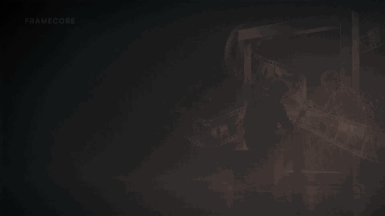</a><br><b>Showreel Motion 2.0</b> · 16:9 · 24 s<br><sub>Tekst kinetyczny, karaoke, przejścia ✦: rozpływ, panorama, glitch, wypalenie, przesłona</sub></td>
<td width="32%" align="center"><a href="assets/framecore-motion2-reel.mp4">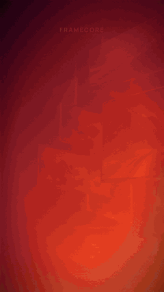</a><br><b>Rolka 9:16</b> · 12 s<br><sub>Napisy karaoke, panorama i kinowy zoom</sub></td>
</tr>
</table>

```bash
python framecore.py sample --showreel   # edytowalny showreel 16:9
python framecore.py sample --reel       # edytowalna rolka 9:16
python scripts/render-showcase.py       # eksport obu filmów i podglądów do assets/
```

| Film | Format | Co pokazuje | Projekt |
| --- | --- | --- | --- |
| [▶ Showreel Motion 2.0](assets/framecore-motion2-showreel.mp4) | 16:9 · 24 s | Nowy silnik ruchu, inne przejście ✦ na każdym cięciu, rozmycie ruchu · [klatki](assets/framecore-motion2-showreel-frames.jpg) | `sample --showreel` |
| [▶ Rolka Motion 2.0](assets/framecore-motion2-reel.mp4) | 9:16 · 12 s | Kinetyczne napisy dla social media, szybka panorama i kinowy zoom · [klatki](assets/framecore-motion2-reel-frames.jpg) | `sample --reel` |
| [▶ Reklama „Twój pomysł. Wspólna rama.”](assets/framecore-agent-campaign.mp4) | 16:9 · 30 s | Sześć scen po 5 s, tła FrameCore Cinema, własny podkład | `sample --campaign` |
| [▶ Przykład współpracy](assets/framecore-collaboration.mp4) | 16:9 · 15 s | Sześć scen z polskimi tekstami i ikonami MIT | `sample` |
| [▶ Creator Pack](assets/framecore-creator-pack.mp4) | 16:9 · 12 s | Wbudowane fonty, ilustracje 3D i animowane tła | `sample --creator-pack` |
| [▶ Pipeline produkcyjny](assets/framecore-production-demo.mp4) | 16:9 · 6 s | Brief, przegląd klatek i paczka dostawy | `sample --production` |
| [▶ Lekcja przez historię](assets/framecore-visual-lesson-demo.mp4) | 16:9 · 21 s | Roboczy pokaz typograficzny siedmiu scen | [instrukcja](examples/visual-lesson/README.md) |

## Rozwój AI Studio — etap P0

Panel **Analiza materiałów** tworzy miniatury, contact sheets, proxy oraz waveform i wykrywa ciszę. Wyniki są buforowane poza projektem i dostępne dla UI oraz agentów przez API/MCP. [Obsługa i ograniczenia](docs/MEDIA_ENGINE.md) · [Audyt i plan P0/P1/P2](docs/AI_STUDIO_AUDIT.md).
