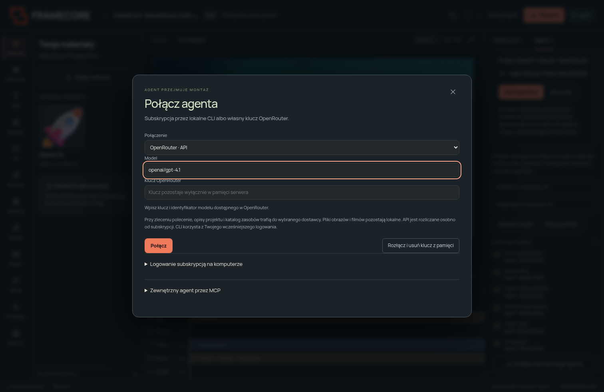

# Agent za sterami dashboardu

Ten dokument opisuje panel zadań i propozycji **Agent AI**. Nowa, iteracyjna rozmowa **Twój agent** ma osobny [onboarding i konfigurację](AGENT_QUICKSTART.md). W Integracjach można przejść do obu trybów; panel opisany tutaj zachowuje klucz tylko w RAM, a nowa rozmowa może zapisać go lokalnie lub odczytać ze zmiennej środowiskowej.

W panelu **Agent AI** kliknij **Podłącz agenta**. Wybierz OpenRouter API, OpenAI przez Codex CLI albo Claude przez Claude Code CLI. Po połączeniu wpisz polecenie i użyj **Zleć agentowi**.



## Tryby pracy

- **Propozycja** — domyślnie agent przygotowuje sprawdzoną listę zmian. Zobaczysz ją w panelu wraz ze zmienionymi i usuniętymi elementami; możesz zastosować albo odrzucić.
- **Agent stosuje zmiany samodzielnie** — zaznacz tę opcję przed zadaniem. Sprawdzone zmiany trafiają do wspólnego montażu jako jeden krok historii. **Cofnij** przywraca wcześniejszą wersję.
- **Zatrzymaj** — odpowiedź trwającego zadania nie będzie już stosowana. Rozłączenie dodatkowo usuwa klucz OpenRouter z pamięci.

Jeden przycisk uruchamia jedno zadanie: model otrzymuje opis projektu, zaznaczenie, reguły i katalog zasobów; zwraca wiadomość oraz do 50 komend edytora. Może zbudować lub przebudować montaż, zmienić klipy, tekst, animacje, klatki kluczowe, tło i markę. To sterowanie edycją wspólnego projektu, nie nieograniczona pętla autonomicznych wywołań. Render i końcowa ocena pozostają osobnymi etapami. Pełny zewnętrzny agent z iteracyjnymi narzędziami może nadal korzystać z [MCP](../MCP_SPEC.md).

## OpenRouter API

1. Wybierz **OpenRouter · API**.
2. Wpisz własny klucz i identyfikator dostępnego modelu, np. `openai/gpt-4.1`. Dostępność, ceny i limity sprawdź na swoim koncie OpenRouter. Studio nie gwarantuje dostępności przykładowego modelu.
3. Kliknij **Połącz**, wpisz zadanie i zleć pracę. Pierwsze zadanie sprawdza odpowiedź dostawcy; samo zapisanie połączenia nie jest testem uwierzytelnienia.

Klucz jest przechowywany wyłącznie w pamięci procesu serwera. Nie trafia do projektu, historii, Local Storage, promptu modelu ani raportu zadania. Po restarcie studia wpisz go ponownie. Serwer wysyła żądania tylko do `https://openrouter.ai/api/v1/chat/completions`; odpowiedzi błędów dostawcy nie są przekazywane z surowymi nagłówkami. W środowisku chmurowym wymagane jest zezwolenie sieciowe dla `openrouter.ai`.

Wywołania API są rozliczane przez dostawcę. Subskrypcja ChatGPT lub Claude nie jest kluczem OpenRouter. Przy zadaniu do dostawcy trafia polecenie, opis projektu, względne ścieżki i metadane materiałów oraz katalog zasobów. Obrazy i filmy nie są przesyłane przez ten panel. Model nie otrzymuje pikseli, więc nie deklaruj wizualnego przeglądu na podstawie jego odpowiedzi.

## OpenAI / Claude przez subskrypcję i CLI

Studio uruchamia lokalny program na **komputerze, na którym działa serwer FrameCore**. Zainstaluj oficjalne [Codex CLI](https://github.com/openai/codex) albo [Claude Code](https://code.claude.com/docs/en/setup), a następnie zaloguj się na tym samym koncie systemowym:

```bash
codex login
claude auth login
```

W panelu wybierz odpowiedni program. Model może pozostać pusty — użyty zostanie domyślny model CLI. Dostęp przez abonament zależy od planu, uprawnień i limitów dostawcy. Wewnętrzne poświadczenia pozostają zarządzane przez CLI; FrameCore nie odczytuje plików logowania ani nie prosi o hasło. Jeżeli CLI jest skonfigurowane do korzystania z klucza API, stosuje się jego zasady rozliczeń.

Adapter Codex wymaga wersji z `exec`, `--ephemeral`, `--ignore-user-config`, `--sandbox read-only` i `--output-last-message`. Uruchamia go w pustym katalogu tymczasowym, z blokadą zatwierdzania komend i bez konfiguracji MCP użytkownika. Adapter Claude używa trybu `-p --output-format json`, wyłącza narzędzia i przekazuje pustą konfigurację MCP. Oba otrzymują instrukcję zwrócenia danych JSON. Model nie edytuje repozytorium ani plików projektu bezpośrednio; wszystkie zwrócone zmiany stosuje walidator FrameCore.

Launchery npm `.cmd` są rozwiązywane do pliku JavaScript oficjalnego pakietu i uruchamiane bez powłoki przez Node.

Na Windows program musi być widoczny w `PATH` procesu uruchamiającego studio. Po instalacji CLI otwórz nowy terminal i uruchom studio ponownie. Instalacja na Windows i logowanie na komputerze użytkownika nie zostały wykonane w chmurze.

## Wspólna praca i ograniczenia

Przed zadaniem serwer zamraża rewizję i zaznaczenie. Jeśli człowiek edytuje treść podczas pracy modelu, zmiana agenta kończy się konfliktem zamiast nadpisania montażu. Zmiana samego zaznaczenia nie przekierowuje polecenia na inny klip. Blokady ścieżek i walidacja całej propozycji nadal obowiązują.

Zatrzymanie API nie cofa już poniesionego kosztu ani nie gwarantuje anulowania obliczeń u dostawcy; odrzuca późniejszą odpowiedź. Proces CLI jest przerywany. Po zastosowaniu zmian użyj Cofnij, aby je wycofać. Stan połączenia i zadania dotyczy jednego procesu serwera; jednocześnie działa najwyżej jedno zadanie. Gdy zmienisz projekt, zadanie nadal odnosi się do projektu wskazanego przy starcie. Odpowiedź może wymagać korekty; agent nie zatwierdza sam własnej jakości kreatywnej.

Po sterowaniu wykonaj `create_review`, obejrzyj film i zmierz gotowy MP4 przez `analyze_export`. Ten panel nie dodaje dostawców generowania obrazów, wideo lub głosu ani transkrypcji; integracje materiałów pozostają oddzielne.

## Punkty HTTP

Wszystkie wymagają POST, JSON, tokena sesji, poprawnego Host i Origin:

| Ścieżka | Działanie |
|---|---|
| `/api/agent/status` | Stan bez sekretów i dostępność CLI |
| `/api/agent/connect` | `provider`, `model`, `api_key` (tylko OpenRouter) |
| `/api/agent/run` | `project_id`, `expected_revision`, `prompt`, opcjonalne `auto_apply` |
| `/api/agent/stop` | Odrzucenie odpowiedzi trwającego zadania |
| `/api/agent/disconnect` | Zatrzymanie i usunięcie połączenia |

Statusy zadania: queued, running, proposed, applied, complete, failed, cancelled. Edycja korzysta z tej samej historii co HTTP i MCP. API połączenia nie jest udostępniane jako narzędzia modelu MCP; kluczem zarządza człowiek w dashboardzie.

## Kontekst marki i szkic company brain

Po wybraniu profilu w Ustawieniach każde zadanie montażu otrzymuje `companyBrain` zamrożony w projekcie: ofertę, ton, design guidelines, źródła i metadane obrazów. Wbudowany tryb **Przygotuj szkic z agentem** porządkuje wklejone materiały bez pobierania stron. Wymaga sprawdzenia oraz osobnego zapisania formularza; wynik zadania ma status `draft`. [Instrukcja profili](COMPANY_BRAIN.md).
