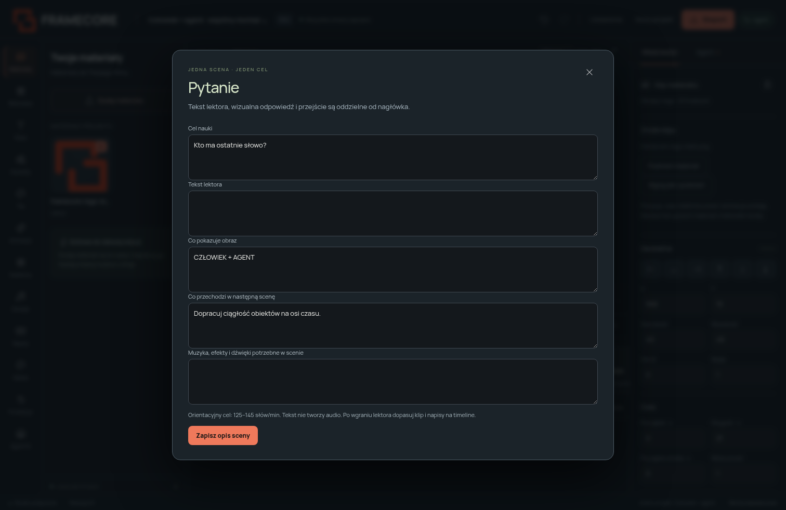

# Wspólny montaż: człowiek i agent

FrameCore zachowuje jeden edytowalny projekt. Agent nie oddaje wyłącznie spłaszczonego MP4: klipy, zdjęcia, teksty, sceny, ścieżki i klatki kluczowe pozostają dostępne w interfejsie. Człowiek może poprawić materiał po pracy agenta, a agent widzi te poprawki w tym samym stanie projektu.

## Materiały i timeline

1. W **Materiałach** wybierz **Dodaj materiały** lub upuść lokalne pliki. Zdjęcia, wideo i dźwięk trafiają do biblioteki projektu. Przebieg wgrywania jest widoczny przy stanie zapisu.
2. Przeciągnij materiał z biblioteki na pustą część ścieżki, aby dodać go w wybranym czasie. Możesz upuścić plik z komputera bezpośrednio na ścieżkę. Obrazy i wideo mogą współdzielić ścieżki wizualne; audio ma osobne ścieżki. Przy imporcie wielu plików wybierz zgodny rodzaj ścieżki.
3. Upuść materiał na istniejący klip, aby **podmienić jego źródło**. Możesz też zaznaczyć klip i wybrać **Podmień materiał** albo **Wgraj plik i podmień** we właściwościach. Prawy przycisk myszy na klipie materiału otwiera podmianę.
4. Podmiana zachowuje identyfikator, start, czas, geometrię, animację i klatki kluczowe. Odtwarzanie nowego źródła zaczyna się od początku. Jeżeli nagranie jest krótsze, zwykła podmiana zostanie odrzucona. W oknie **Podmień materiał** wybierz źródło i zaznacz dopasowanie: klip skróci się, a klatki kluczowe zostaną dopasowane do nowego zakresu. Plik, który został już wgrany, pozostaje w bibliotece.
5. Na timeline przeciągaj środek klipu, aby zmienić start, i uchwyty po bokach, aby przyciąć zakres. **Przyciąganie** pomaga wyrównać klip do początku lub końca innych klipów i wskaźnika. Wyłącz je, aby poruszać się z dokładnością jednej klatki. Nagrania nie rozciągają się poza rzeczywistą długość źródła.
6. Przycisk **＋** dodaje ścieżkę; **⧉** duplikuje zaznaczony klip. Przeciągaj klipy pionowo między zgodnymi ścieżkami. Blokada **○ / ●** chroni ścieżkę przed zmianami; oko ukrywa obraz, a głośnik wycisza audio.
7. Miniatury pomagają rozpoznać obraz lub nagranie. Są podglądem materiału, nie analizą jego treści ani rozpisaniem wszystkich klatek źródłowych. Wszystkie operacje montażu trafiają do historii i obsługują Cofnij/Ponów.

Wgrywanie jest przypisane do projektu wskazanego na początku operacji. Jeśli zmienisz projekt podczas wgrywania, interfejs nie przeniesie plików do nowego filmu; komunikat wskaże powrót do poprzedniego projektu.

To rozwinięcie lokalnego edytora w kierunku prostego montażu znanego z CapCut. Nie jest to integracja z CapCut ani pełna kopia jego funkcji. Muzyka, transkrypcja i generowanie mediów pozostają oddzielnymi integracjami.

## Lekcja przez historię

Adaptacja grafiki promptu przekazanej przez użytkownika dodaje **Produkcja → Lekcja przez historię**. Zamiast narzucać model AI lub wygląd każdemu filmowi, daje osobny tryb narracyjny:

**Pytanie → znany przykład → problem → mechanizm → odkrycie → konsekwencja → odpowiedź.**

Podaj temat, odbiorców, główną myśl, błędne przekonanie i pytanie otwierające. Wybierz długość, przygotuj plan i popraw siedem nagłówków. Zbudowanie montażu tworzy zwykłe teksty, podpisy oraz karty do uzupełnienia materiałami. Istniejący montaż wymaga zaznaczenia zastąpienia; całą operację cofniesz jednym krokiem.

Plan jest **punktem wyjścia**, nie ukończoną lekcją ani potwierdzonym wyjaśnieniem tematu. Uzupełnij konkretny przykład, mechanizm, obrazy i głos. Papierowy kierunek (krem, węgiel, koral i Manrope) jest opcjonalny. Dla projektu z profilem marki domyślnie pozostają kolory i font klienta. Tryb ustawia 24 FPS; możesz zmienić FPS we właściwościach projektu po odznaczeniu klipów. Format 16:9 daje 1920×1080, a inne formaty pozostają dostępne.

W **Planie scen → Cel i tekst lektora** zapiszesz cel nauki, tekst lektora, zamysł obrazu, przejście i dźwięki. Te opisy są dostępne agentowi. Nie są dowolnym kodem, nie tworzą nagrania głosu i nie generują automatycznie fizycznych przejść. Agent buduje je dostępnymi animacjami, mediami i klatkami kluczowymi, a człowiek może je poprawić na timeline.

**Sprawdź opisy i tempo narracji** wskazuje brakujące informacje i orientacyjne słowa na minutę. 125–145 słów/min jest wskazówką dla spokojnej narracji. Prawdziwe nagranie może mieć inny rytm; dopasuj sceny po wgraniu audio. Przegląd powinien sprawdzić jednoznaczny cel każdej sceny, odpowiedź na pytanie otwierające, znaczenie bez polegania tylko na kolorze, czytelność na telefonie i ciągłość obiektów. Obejrzyj film bez dźwięku oraz odsłuchaj sam dźwięk.

Bramka przeglądu jest włączana przy zbudowaniu lekcji. Roboczy eksport nadal służy do sprawdzenia filmu; finalna wersja wymaga oceny aktualnej rewizji. Kontrola pól nie potwierdza prawdziwości treści, sensu historii, synchronizacji lektora ani spójności postaci.

## Narzędzia dla agenta

| Narzędzie | Zastosowanie |
|---|---|
| `replace_clip_asset` | `element_id`, `asset_id`, opcjonalne `fit_source`; podmiana bez odtwarzania całego klipu |
| `add_track` | `kind`, `name`; dodatkowa warstwa, limit 24 ścieżek |
| `move_clip` | `start`, opcjonalne `track_id`; montaż między odblokowanymi, zgodnymi ścieżkami |
| `set_project_fps` | Całkowite `fps`, 1–60 |
| `get_storytelling_playbook` | Zasady narracji i checklista z adaptacji referencji |
| `plan_visual_lesson` | `brief`, opcjonalne `duration`; siedem propozycji scen bez zmiany projektu |
| `assemble_visual_lesson` | `brief`, opcjonalne `scenes`, `duration`, `replace`, `paper_style`; edytowalny montaż |
| `set_learning_brief` | `brief`: `topic`, `audience`, `coreIdea`, `misconception`, `openingQuestion` |
| `set_scene_learning` | `scene_id`, `lesson`: `phase`, `purpose`, `narration`, `visual`, `transition`, `audio` |
| `get_lesson_status` | Kompletność opisów i szacowane tempo tekstu |

Każdy zapis wymaga `project_id` i `expected_revision`. `get_storytelling_playbook` działa bez projektu. Fazy to `hook`, `familiar`, `disruption`, `mechanism`, `discovery`, `consequence`, `recap`. `assemble_visual_lesson` przyjmuje siedem scen w tej kolejności, bez luk i nakładania przedziałów czasu. Odczytaj aktualny projekt przed zmianą, respektuj blokady i używaj propozycji przy większych przebudowach.

Dashboard przekazuje agentowi te same komendy i zasady. Nie uruchomiono konkretnego modelu z nazwy widocznej w grafice; obsługiwane połączenia pozostają Codex, Claude CLI i OpenRouter. Przed oddaniem filmu człowiekowi agent powinien zostawić opisy scen, materiały i edytowalne klipy, wskazać brakujący lektor lub inne zasoby oraz przejrzeć rzeczywiste klatki. Nie ma automatycznego przełącznika „gotowa lekcja” opartego wyłącznie na planie.

## Przykład i sprawdzenie

[Edytowalny przykład](../examples/visual-lesson/README.md) tworzy własną kopię w bibliotece projektów. [Film roboczy](../assets/framecore-visual-lesson-demo.mp4) ma 21 sekund, 640 × 360 i 24 FPS, bez audio. [Plansza klatek](../assets/framecore-visual-lesson-review.jpg) pokazuje pytanie otwierające i odpowiedź w finale. To prototyp typograficzny do dalszej edycji.

