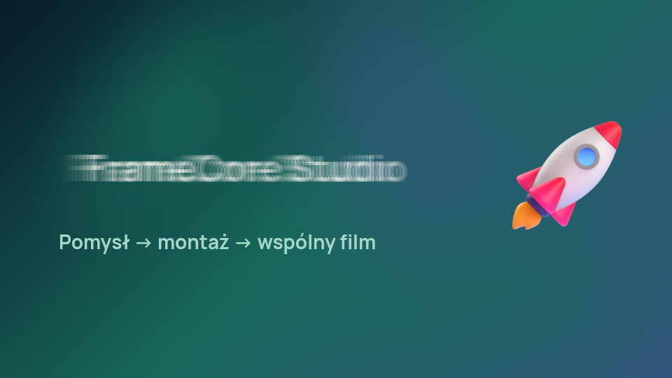

# Rozwiązania fframes w FrameCore

Przejrzeliśmy [dmtrKovalenko/fframes](https://github.com/dmtrKovalenko/fframes/tree/b7fc055f7028f4380ed6102d33040fd1bf491036): workflow agenta, adresowanie klatek, plansze, nakładki ruchu i porównywanie obrazów. Adaptacja jest przypięta do commitu `b7fc055f7028f4380ed6102d33040fd1bf491036`; [oryginalna licencja MIT](../licenses/fframes-MIT.txt), Copyright (c) 2025–2026 Dmitriy Kovalenko.

Wdrożone funkcje korzystają z obecnego renderera Chromium i projektu JSON FrameCore. Nie zainstalowano ani nie uruchomiono natywnego silnika Rust/Skia; wyników wydajności GPU podanych przez upstream nie odnosimy do FrameCore.

## Laboratorium ruchu

Otwórz **Produkcja → Laboratorium ruchu · fframes**. Wybierz scenę albo cały film i 2–24 klatki. **Plansza i tor ruchu** zapisuje rzeczywiste klatki, podpisaną planszę i obraz z ich nałożenia. Późniejsze klatki mają liniowo większą wagę, dlatego końcowa pozycja jest mocniejsza, a droga ruchu pozostaje widoczna. Nakładka dotyczy pełnego kadru i próbek, nie izoluje automatycznie pojedynczego obiektu.



Agent otrzymuje planszę JPEG oraz nakładkę PNG bezpośrednio jako obrazy MCP:

```json
{"name":"create_motion_strip","arguments":{"project_id":"fc_…","expected_revision":7,"start":"scene_…@0s","end":"scene_…@end","count":12}}
```

Funkcja tworzy przegląd podobnie do `create_review`, nie zatwierdza go automatycznie. Obowiązują sprawdzenie materiałów, rewizji, pola tekstu, kadru i próbki powrotów do czasu. Nowy przegląd wymaga własnej oceny, również gdy starszy przegląd tej rewizji był zatwierdzony.

## Czytelne adresy klatek

`resolve_frame_time` przyjmuje `project_id` i `spec`. Wynik jest czasem w sekundach do podglądu albo `capture_frame`.

| Adres | Znaczenie |
|---|---|
| `30` lub `30f` | Klatka 30, przy 30 FPS: 1 s |
| `1.2s` / `1200ms` | Czas globalny |
| `0:03` | Minuty : sekundy |
| `50%` | Połowa filmu, z zaokrągleniem do klatki |
| `end` | Ostatnia klatka filmu |
| `scene_…@50%` | Połowa wybranej sceny |
| `Otwarcie@end` | Ostatnia klatka sceny o jednoznacznej nazwie |

Identyfikator sceny jest zalecany: zduplikowana nazwa nie jest jednoznacznym adresem. Liczbowe `spec` zachowuje konwencję wcześniejszego API — oznacza sekundy; tekst bez jednostki oznacza indeks klatki. Niepoprawne adresy, wartości poza zakresem i niejednoznaczne sceny są odrzucane.

## Porównanie przed / po

`list_reviews` podaje identyfikatory, rewizje i harmonogramy zapisanych przeglądów (do 100 najnowszych). Wskaż przegląd przed zmianą oraz po zmianie w panelu. `compare_reviews` wymaga tych samych czasów i rozdzielczości; generuje pełne PNG z zaznaczonymi zmianami i udział zmienionych pikseli dla każdej próbki.

```json
{"name":"compare_reviews","arguments":{"project_id":"fc_…","baseline_id":"review_…","review_id":"review_…","threshold":16,"max_diff_ratio":0.001}}
```

Próg różnicy kanału 16/255 ogranicza wpływ drobnych różnic antyaliasingu. Domyślna tolerancja udziału różniących się pikseli to 0,1%. W razie potrzeby wygeneruj nowy `create_review` z `times` poprzedniego przeglądu. Identyczny artefakt jest zgodny; zmiana tekstu daje różnice. Nie nadpisujemy wzorca automatycznie.

**Zmiana pikseli nie mówi, czy film jest lepszy.** Punkt odniesienia jest wybranym przez Ciebie przeglądem, nie automatyczną akceptacją. Kolorowe różnice pomagają krytykowi znaleźć zmienione miejsca; nie obejmują wszystkich klatek, odsłuchu ani prawdziwości komunikatów. [Przykład różnic](../assets/framecore-motion-diff.png).

Narzędzia nie dodają zależności Rust, WebAssembly ani GPU. Korzystają z już wymaganych Playwright, Pillow i NumPy. Pomiary audio gotowego filmu są w [adaptacji Motion Video Kit](MOTION_VIDEO_KIT.md). Integracja natywnego renderera Skia i per-scene analizy audio pozostaje osobnym zadaniem.
